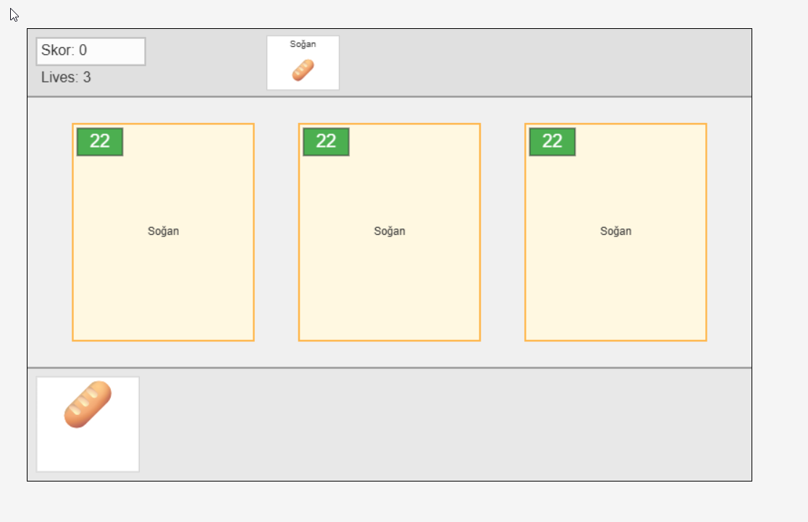
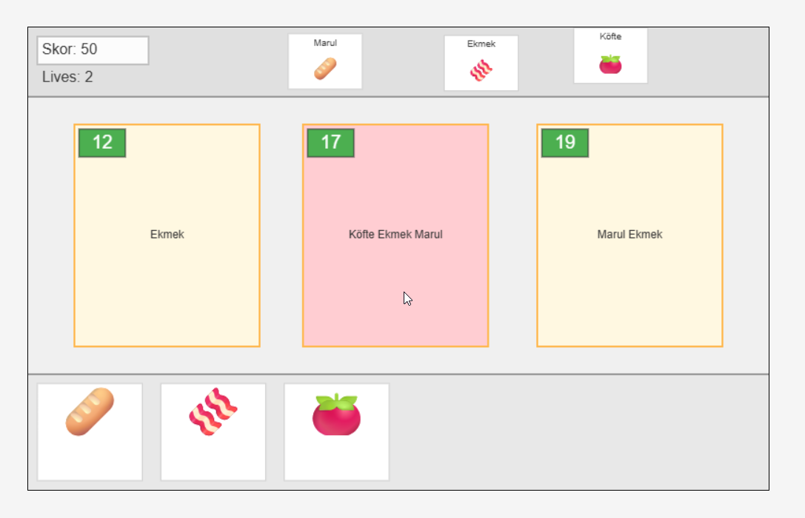

# 🧠🍔 Kaotik Mutfak - Bir Mantık Restoranı Oyunu

> **"Köfte dediysem köfte değil, domates koy demek istedim!"**  

---
[Oyun linki→](https://hasnasahinoglu.github.io/js_game/)
## 🎯 OYUNUN HEDEFİ

**Kaotik Mutfak**, restoran yönetimi HTML5 tabanlı bir canvas oyunudur.

Oyuncu, gelen siparişleri müşteri notlarına göre **doğru yorumlayarak** hamburger hazırlamalıdır. Ancak işin püf noktası şu:

> 🍽 Siparişlerin arkasında karmaşık kurallar, ters mantıklar ve gizli anlamlar var.

---

## 🔥 ZORLUK (CHALLENGE)

Oyundaki asıl zorluk:

- Siparişteki malzeme isimleri rastgele eşleştirilmiş! (Köfte demek bazen domates demek olabilir!)
Her siparişi doğru yorumlayarak hazırlamalı, müşterileri memnun etmelisin. Skor arttıkça gelen siparişler daha karmaşık hale gelir.

---

## 🕹️ KONTROLLER

Malzemeleri siparişlerin üzerine sürükle-bırak.

---

## 🖼️ OYUN GÖRSELLERİ

### 🧩 Siparişin geldiği an:


### 🍔 Malzeme seçimi ve burger hazırlama:



---

## 🚀 OYUNU DENE

Oyunu yerel olarak çalıştırmak için:

```bash
git clone https://github.com/hasnasahinoglu/js_game.git
cd js_game_project
open index.html
